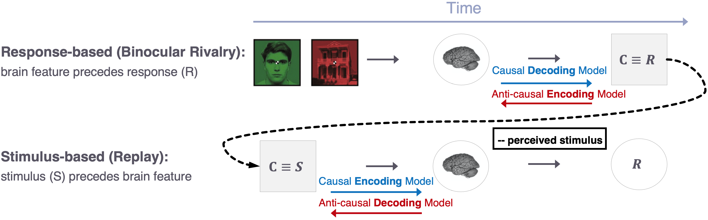
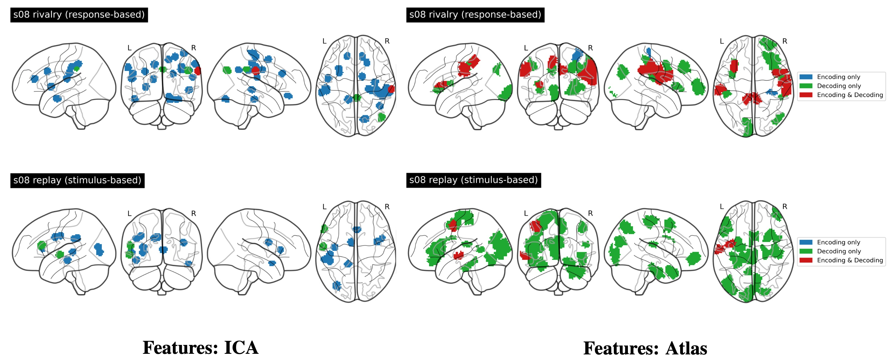
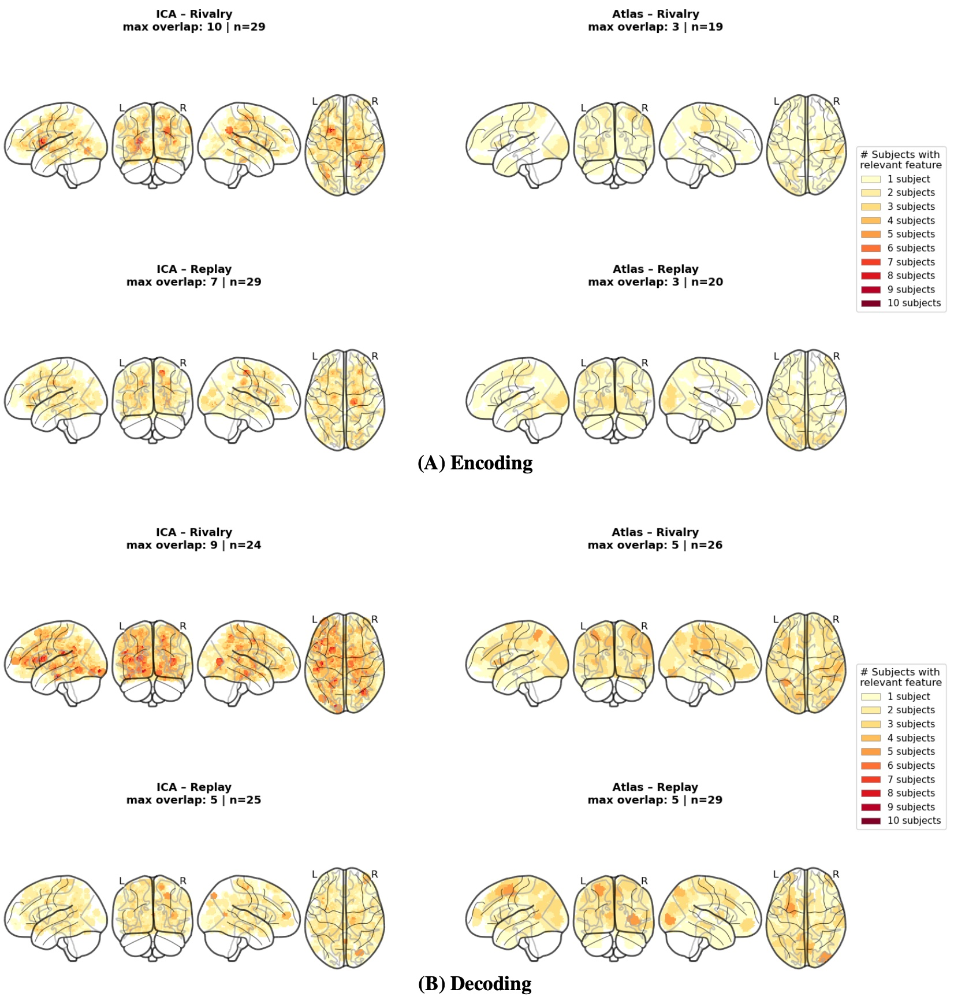

# Causal Inference in fMRI: Binocular Rivalry vs Replay

This repository contains the core scripts used in the lab report workflow for causal interpretation of fMRI signals during binocular rivalry (BR) and replay conditions.

## Goal

The analysis asks which brain features are:
- associated with stimulus-related information (encoding),
- predictive of perceptual/readout labels (decoding), and
- jointly informative for causal interpretation across BR and Replay.

## Analysis Order

1. [1_fit_glm.py](1_fit_glm.py)  
   Preprocesses run-wise behavioral/fMRI timing, builds design matrices, and computes first-level GLM contrasts.

2. [2_utils.py](2_utils.py)  
   Shared helpers for subject/session overview and temporal diagnostics.

3. [3_decode_subjects.py](3_decode_subjects.py)  
   Subject-level decoding pipeline (GLM-derived maps -> ICA/feature space -> classifier evaluation).

4. [4_create_joint_enc_dec.py](4_create_joint_enc_dec.py)  
   Creates a joint encoding-decoding dataframe. Supports:
   - ICA pipeline mode (`run-ica-analysis`), and
   - merge mode for existing ICA **or atlas** encoding/decoding CSVs.

5. [5_causal_interpretations.ipynb](5_causal_interpretations.ipynb)  
   Visual and table-based causal interpretation on joint outputs.

## Core Outputs

- Encoding tables (`num_significant_features`, selected feature indices, p-values)
- Decoding tables (accuracy metrics, selected feature indices, p-values)
- Joint encoding-decoding tables for interpretation
- Visualization outputs at individual and group summary levels

## Figures

### 1) Setup Plot (Task/Design Overview)

**Caption:** The plot illustrates that the data were acquired under two experimental conditions: binocular rivalry and replay, corresponding to response-based and stimulus-based paradigms, respectively (see schematic). The dataset originates from (Zaretskaya et al., 2010). Brain states were measured using fMRI, and the variable C represents either the perceptual response or the external stimulus, depending on the paradigm. In the response-based setting (binocular rivalry), the brain state temporally precedes the condition C, which is defined by the subject’s reported percept. In contrast, in the stimulus-based setting (replay), the condition C is determined by the externally controlled stimulus and precedes the measured brain state. The replay block always follows the rivalry block, as its stimulus sequence is constructed from the perceptual reports obtained during rivalry. Encoding and decoding models are applied to relate brain states and the condition C. Depending on whether the model follows or opposes the temporal direction between C and the brain state, it is interpreted as causal or anti-causal.

---

### 2) Individual-Level Plot

**Caption:** Blue indicates features relevant for encoding, green for decoding, and red denotes overlap. In rivalry, the ICA maps show one localized encoding and decoding cluster, while the atlas maps contain broader regions with multiple visible overlap components. In replay, the feature sets are smaller overall, with fewer overlap regions and a stronger separation between encoding and decoding. For ICA-based components, mostly encoding features are relevant and for atlas-based features, mostly decoding features.

---

### 3) Group-Level Plot

**Caption:** The figure shows the number of subjects with relevant features for ICA (left) and atlas (right), separated into rivalry and replay conditions. Warmer colors indicate higher overlap. ICA maps show higher peak overlap and more spatially consistent patterns, particularly in rivalry, whereas atlas maps appear more diffuse with lower maximum overlap. The captions for each individual plot indicate the maximum overlap for the respective condition and the number of subjects included. For excluded subjects, we did not find any relevant features in the respective condition.

## Minimal Usage

Run from project root (after environment activation):

- Build joint dataframe from existing outputs (atlas or ICA):
  - `python repo/4_create_joint_enc_dec.py --feature-space atlas --mode merge`
  - `python repo/4_create_joint_enc_dec.py --feature-space ica --mode merge`

- Full ICA encoding+decoding+joint workflow:
  - `python repo/4_create_joint_enc_dec.py --feature-space ica --mode run-ica-analysis`

Then open [5_causal_interpretations.ipynb](5_causal_interpretations.ipynb) for interpretation plots and summary tables.

## Notes

- Paths inside scripts should match your local data/output layout.
- The repository is organized as a compact, report-oriented subset of the full project pipeline.
